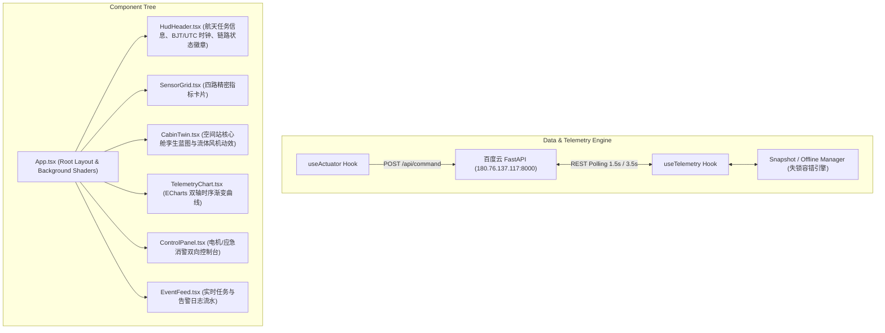

# 太空空间站舱内环境监测数字孪生大屏系统设计规格说明书 (Design Spec)

- 日期: 2026-09-01
- 项目代号: `CSS-CABIN-01`
- 目标平台: React 18 + TypeScript + Vite + Tailwind CSS + ECharts 5 + Framer Motion
- 关联设备: OpenHarmony RK2206 南向开发板 (`192.168.9.51`)
- 关联云端: 百度智能云 BCC 微服务 (`http://180.76.137.117:8000`)

---

## 1. 系统概述与设计哲学

本系统是“太空空间站内部环境监测端云一体化系统”的北向大屏可视化与远程控制中心。
设计严格贯彻 **Anti-AI Slop（去通用 AI 廉价质感）** 原则与 **Mission Control（航天地面控制中心）** 工业设计标准：
1. **真实工程质感**：采用深空灰蓝基底（`#060812` / `#0B132B`）、1px 细线刻度标尺、物理传感器引脚标签（如 `I2C0@0x44`、`SARADC_CH2`）、等宽数字排版（`font-variant-numeric: tabular-nums`）；
2. **严谨的语义化色彩**：仅在表达真实设备状态和指标越限时使用色彩，杜绝刺眼廉价的大面积霓虹渐变；
3. **数字孪生真实映射**：核心舱 2D/3D 蓝图精确联动桌上真实开发板电机的物理启停状态与转速气流。

---

## 2. 系统信息架构与组件分解

### 核心组件职责划分：
1. `HudHeader.tsx`：
   - 任务编号 `CSS-CABIN-01` 与天宫监测系统元数据；
   - 毫秒级对齐的北京时间（BJT）与世界协调时（UTC）双时钟；
   - 开发板链路状态徽章：在线显示绿色 `[LIVE LINK]` + IP + 报文计数；离线平滑切换至橙色 `[LINK LOST]` + 记录最后同步时间。
2. `SensorGrid.tsx`：
   - **温度卡片**（SHT30）：实时值（℃）、标称区间（18.0~28.0℃）、报警阈值（>38.0℃）；
   - **湿度卡片**（SHT30）：实时值（% RH）、标称区间（40.0~65.0%）、报警阈值（>85.0%）；
   - **光照卡片**（BH1750）：实时值（Lux）、标称区间（100~800 Lux）、暗光阈值（<20 Lux）；
   - **烟雾毒气卡片**（MQ2）：实时值（PPM）、安全洁净（<50 PPM）、越限阈值（>100 PPM）；
   - 支持失锁时的 `[CACHED]` 标记与动态刻度槽。
3. `CabinTwin.tsx`：
   - 空间站核心舱（睡眠区、实验区、环控生保区）矢量剖面；
   - 传感器安装点状态光晕联动；
   - 环控生保排风电机 60fps 动态旋转与 Canvas 空气微粒流体模拟。
4. `TelemetryChart.tsx`：
   - 基于 ECharts 5 渲染温湿度双 Y 轴平滑折线走势图与烟雾/光照时序图；
   - 自适应深色主题，低对比度网格线，渐变色面积填充；
   - 支持实时秒级推流与历史数据回溯。
5. `ControlPanel.tsx`：
   - 机械质感排风电机远程开关（触发 `POST /api/command {"target":"motor","action":"on/off"}`，控制开发板电机运转并监听 ACK）；
   - 应急消警与静音按钮（触发 `POST /api/command {"target":"alarm","action":"ack"}`）；
   - 动态阈值自定义配置抽屉。
6. `EventFeed.tsx`：
   - 滚动展示实时遥测报文、控制台下发记录与系统异常告警。

---

## 3. 数据契约与接口规范

| 接口名称 | HTTP 方法与路径 | 轮询/触发周期 | 描述 |
| :--- | :--- | :--- | :--- |
| **最新遥测** | `GET /api/telemetry/latest?device_id=rk2206-station-01` | 1.5s 周期轮询 | 获取开发板最新上报的四路环境数据 |
| **历史走势** | `GET /api/telemetry/history?device_id=rk2206-station-01&limit=30` | 3.5s 周期轮询 | 获取最近 30 条时序数据用于图表绘制 |
| **下发指令** | `POST /api/command` | 手动触发 | 下发电机启停、LED 启停或消警动作 |
| **告警流水** | `GET /api/alerts?limit=10` | 5.0s 周期轮询 | 获取历史超标告警事件列表 |

---

## 4. 容错与异常处理机制
1. **遥测失锁快照保护 (Snapshot Mode)**：
   - 当连续 2 次请求失败（>3s 无响应），进入失锁快照状态；
   - 保留最后已知有效数据，打上黄色 `[CACHED]` 标记；
   - 后台以 2s 周期静默重连探测，一旦检测到服务器响应，立即平滑恢复为实时模式。
2. **防重复点击与指令幂等**：
   - 控制按钮点击后进入 Loading 状态，收到服务端返回（或 3s 超时）后才恢复可交互状态，防止短时间内大量重复排队。
3. **Web Audio 提示音**：
   - 采用纯 Web Audio API 合成低音量、专业克制的点击音与告警警报音，支持右上角一键全局静音。

---

## 5. 验收标准
1. **视觉规范**：完全脱离 AI 生成的塑料感与花哨渐变，呈现严谨高质感的航天地面站 UI；
2. **功能闭环**：大屏在电脑浏览器中能够流畅实时刷新开发板环境数据；
3. **端云控制**：在大屏上点击“启动电机”，桌上的 RK2206 开发板电机在 2~3 秒内启动旋转，并在大屏日志中显示 `executed on rk2206` 回执；
4. **断网容错**：拔掉开发板电源或断网时，大屏优雅呈现失锁快照与重连提示，无任何崩溃或白屏。
